# Datenmodell — Übersicht

Zeigt alle Entitäten und ihre Beziehungen ohne Attribute. Dient als
Landkarte; Details je Bereich siehe die begleitenden Kontextdiagramme
(01–07).

```mermaid
erDiagram
    %% --- Identität ---
    USER }o--o{ ROLE : hat
    USER ||--o{ REFRESH_TOKEN : besitzt
    USER ||--o{ VERIFICATION_TOKEN : besitzt
    USER ||--o{ LOGIN_ATTEMPT : verursacht
    USER ||--o| TOTP_CREDENTIAL : besitzt
    USER ||--o{ RECOVERY_CODE : besitzt

    %% --- Datenschutz ---
    USER ||--o{ CONSENT_RECORD : erteilt
    USER ||--o{ DATA_EXPORT_REQUEST : fordert_an
    USER ||--o{ AUDIT_ENTRY : verursacht
    POLICY_DOCUMENT ||--o{ CONSENT_RECORD : bezieht_sich_auf

    %% --- Stammdaten & Stellenanzeigen ---
    USER ||--o{ COMPANY : besitzt
    USER ||--o{ CONTACT : besitzt
    USER ||--o{ JOB_POSTING : besitzt
    COMPANY ||--o{ CONTACT : beschäftigt
    COMPANY ||--o{ JOB_POSTING : schreibt_aus
    SOURCE_DOCUMENT ||--o| JOB_POSTING : ist_grundlage_fuer
    JOB_POSTING ||--o{ JOB_REQUIREMENT : fordert
    SKILL ||--o{ JOB_REQUIREMENT : referenziert_durch

    %% --- Bewerbungen ---
    USER ||--o{ APPLICATION : besitzt
    JOB_POSTING ||--o{ APPLICATION : wird_beworben_durch
    APPLICATION ||--o{ APPLICATION_STATUS_EVENT : durchlaeuft
    APPLICATION ||--o{ APPLICATION_NOTE : hat
    APPLICATION }o--o{ CONTACT : involviert

    %% --- Dokumente ---
    USER ||--o{ DOCUMENT : besitzt
    DOCUMENT ||--o{ DOCUMENT_VERSION : hat
    APPLICATION }o--o{ DOCUMENT_VERSION : reicht_ein

    %% --- KI-Verarbeitung ---
    USER ||--o{ EXTRACTION_JOB : startet
    SOURCE_DOCUMENT ||--o| EXTRACTION_JOB : eingabe_fuer
    DOCUMENT_VERSION ||--o| EXTRACTION_JOB : eingabe_fuer
    EXTRACTION_JOB ||--o| EXTRACTION_PROPOSAL : erzeugt
    EXTRACTION_JOB ||--o{ AI_USAGE_RECORD : verursacht
    USER ||--o{ AI_BUDGET : hat

    %% --- Profil & Skills ---
    DOCUMENT_VERSION ||--o| CANDIDATE_PROFILE : erzeugt
    CANDIDATE_PROFILE ||--o{ PROFILE_SKILL : hat
    CANDIDATE_PROFILE ||--o{ PROFILE_EXPERIENCE : hat
    CANDIDATE_PROFILE ||--o{ PROFILE_EDUCATION : hat
    SKILL ||--o{ SKILL_ALIAS : hat
    SKILL ||--o{ PROFILE_SKILL : referenziert_durch

    %% --- Termine & Aufgaben ---
    APPLICATION ||--o{ INTERVIEW_EVENT : hat
    USER ||--o{ TASK : hat
    APPLICATION ||--o{ TASK : erzeugt
    TASK ||--o{ NOTIFICATION : loest_aus
    INTERVIEW_EVENT ||--o{ NOTIFICATION : loest_aus

    %% --- Passung ---
    JOB_POSTING ||--o{ FIT_ASSESSMENT : bewertet_durch
    CANDIDATE_PROFILE ||--o{ FIT_ASSESSMENT : bewertet_durch
    FIT_ASSESSMENT ||--o{ FIT_FACTOR : besteht_aus

    %% --- Sonstiges ---
    USER ||--o{ SAVED_FILTER : besitzt
    USER ||--o{ IMPORT_JOB : startet
```

**Hinweis:** `ApplicationDocument` und `ApplicationContact` sind hier als
n:m-Beziehungen dargestellt, obwohl sie technisch eigene Tabellen mit
Zusatzattributen sind (Rolle bzw. Funktion im Prozess). Details dazu in
den Kontextdiagrammen 01 und 02.
