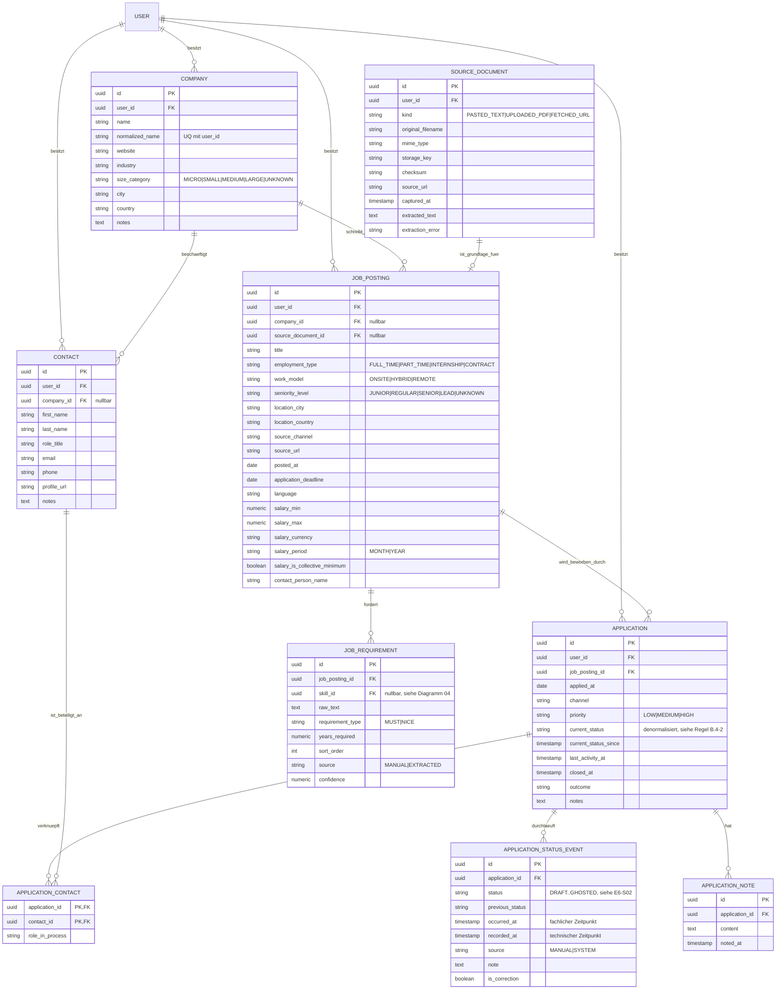

# Datenmodell — Bewerbungen, Stellenanzeigen, Stammdaten

Entspricht den Epics E4, E5, E6. Kernstück: `Application` mit
`ApplicationStatusEvent` als unveränderlicher Ereigniskette — der
aktuelle Status ist ein abgeleiteter Lesewert, keine primäre Wahrheit.

**Zu beachten beim Übertragen:**
- `JobPosting.company_id` ist nullbar — eine Anzeige kann ohne bekannte
  Firma existieren (Deduplizierung erfolgt später, siehe E4-S02).
- `Application` → `JobPosting` ist **1:n**, nicht 1:1: eine erneute
  Bewerbung auf dieselbe Anzeige ist ein zweiter `Application`-Datensatz.
- `ApplicationStatusEvent` ist **nur einfügbar**, nie änderbar — im
  ER-Diagramm nicht sichtbar, aber in `RESTRICTIONS.md`/ADR festzuhalten.
- `DocumentVersion` (siehe Diagramm 02) und `Skill` (siehe Diagramm 04)
  sind hier nur referenziert, nicht vollständig dargestellt.
