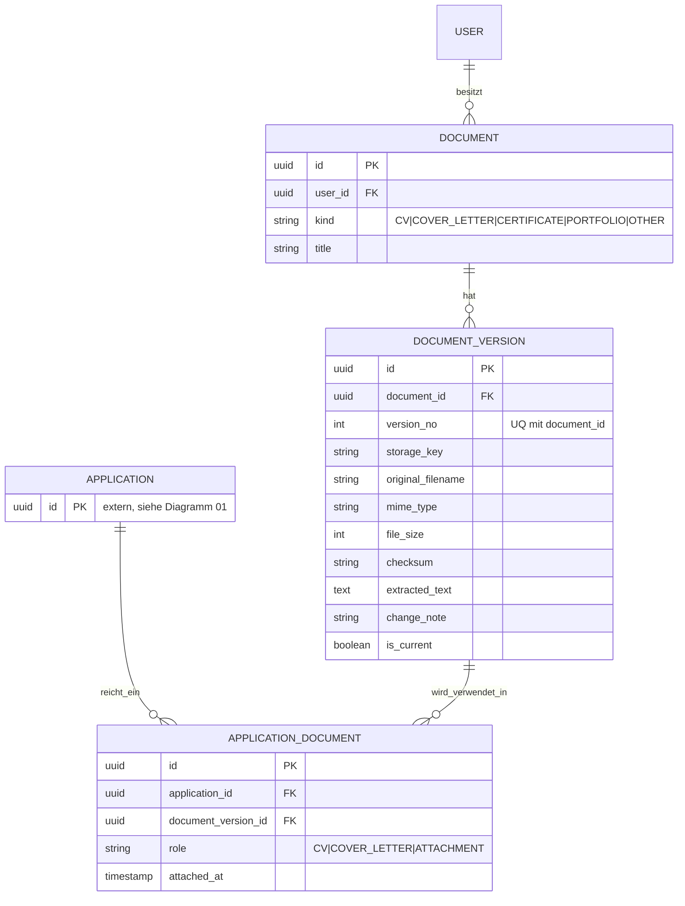

# Datenmodell — Dokumente und Versionierung

Entspricht Epic E7. Kernpunkt: `ApplicationDocument` referenziert eine
konkrete `DocumentVersion`, nicht das `Document` selbst — eine spätere
Überarbeitung ändert nichts an bereits eingereichten Fassungen.

**Zu beachten:**
- `ApplicationDocument` hat einen eindeutigen Schlüssel über
  (`application_id`, `document_version_id`, `role`) — dieselbe Version
  kann derselben Bewerbung nicht zweimal in derselben Rolle zugeordnet
  werden.
- `DocumentVersion.is_current`: genau ein Datensatz je `document_id` darf
  `true` sein — im ER-Diagramm nicht abbildbar, gehört als
  Check-Constraint bzw. Anwendungslogik ins Flyway-Skript.
- Der Pfeil `DOCUMENT_VERSION ||--o| CANDIDATE_PROFILE` (höchstens ein
  Profil je Lebenslauf-Version) ist Teil von Diagramm 04, nicht hier
  wiederholt.
