# Datenmodell — Identität, Zugang, Datenschutz

Entspricht den Epics E2 und E3. Trägt keine fachlichen Bewerbungsdaten —
bewusst als eigener, von den fachlichen Domänen entkoppelter Bereich.

```mermaid
erDiagram
    USER }o--o{ ROLE : hat
    USER ||--o{ REFRESH_TOKEN : besitzt
    USER ||--o{ VERIFICATION_TOKEN : besitzt
    USER ||--o{ LOGIN_ATTEMPT : verursacht
    USER ||--o| TOTP_CREDENTIAL : besitzt
    USER ||--o{ RECOVERY_CODE : besitzt
    USER ||--o{ CONSENT_RECORD : erteilt
    USER ||--o{ DATA_EXPORT_REQUEST : fordert_an
    USER ||--o{ AUDIT_ENTRY : verursacht
    POLICY_DOCUMENT ||--o{ CONSENT_RECORD : bezieht_sich_auf

    USER {
        uuid id PK
        string email "UQ, kleingeschrieben"
        string password_hash
        string display_name
        string status "PENDING_VERIFICATION|ACTIVE|LOCKED|PENDING_DELETION"
        string locale
        string time_zone
        timestamp email_verified_at
        timestamp last_login_at
        timestamp deletion_requested_at
        int ghosting_threshold_days "Vorgabe 30"
        boolean notifications_enabled
    }

    ROLE {
        uuid id PK
        string name "UQ"
        string description
    }

    USER_ROLE {
        uuid user_id PK, FK
        uuid role_id PK, FK
    }

    REFRESH_TOKEN {
        uuid id PK
        uuid user_id FK
        string token_hash "UQ"
        timestamp issued_at
        timestamp expires_at
        timestamp revoked_at
        string device_label
        timestamp last_used_at
        string ip_hash
    }

    VERIFICATION_TOKEN {
        uuid id PK
        uuid user_id FK
        string type "EMAIL_VERIFICATION|PASSWORD_RESET|EMAIL_CHANGE"
        string token_hash "UQ"
        text payload
        timestamp expires_at
        timestamp consumed_at
    }

    LOGIN_ATTEMPT {
        uuid id PK
        string email_attempted
        uuid user_id FK "nullbar"
        boolean successful
        timestamp attempted_at
        string ip_hash
        string user_agent
    }

    TOTP_CREDENTIAL {
        uuid id PK
        uuid user_id FK "UQ"
        string secret_encrypted
        timestamp activated_at
        int last_used_counter
    }

    RECOVERY_CODE {
        uuid id PK
        uuid user_id FK
        string code_hash
        timestamp consumed_at
    }

    POLICY_DOCUMENT {
        uuid id PK
        string type "TERMS|PRIVACY"
        string version "UQ mit type"
        text content
        timestamp published_at
    }

    CONSENT_RECORD {
        uuid id PK
        uuid user_id FK
        string purpose "TERMS|PRIVACY|AI_PROCESSING"
        uuid policy_document_id FK "nullbar"
        timestamp granted_at
        timestamp revoked_at
    }

    DATA_EXPORT_REQUEST {
        uuid id PK
        uuid user_id FK
        string status "QUEUED|RUNNING|READY|FAILED|EXPIRED"
        timestamp requested_at
        timestamp completed_at
        string storage_key
        timestamp expires_at
    }

    AUDIT_ENTRY {
        uuid id PK
        uuid user_id FK "nullbar"
        string event_type
        timestamp occurred_at
        string ip_hash
        jsonb details
    }
```

**Zu beachten:**
- `RetentionPolicy` (Aufbewahrungsfristen je Entitätstyp) ist bewusst
  ausgelassen — sie referenziert keinen Fremdschlüssel, sondern nur einen
  Entitätstyp-Namen als String, und gehört fachlich eher zur
  Betriebsdokumentation als ins ER-Diagramm.
- `AuditEntry` ist **nur einfügbar** (siehe B.4-2) — im Diagramm nicht
  darstellbar, als Kommentar im Flyway-Skript festhalten (z. B. kein
  `updated_at`-Trigger).
- `LoginAttempt.user_id` ist bewusst nullbar: ein Versuch mit unbekannter
  E-Mail-Adresse muss protokollierbar sein, ohne einen Nutzer zu
  referenzieren.
