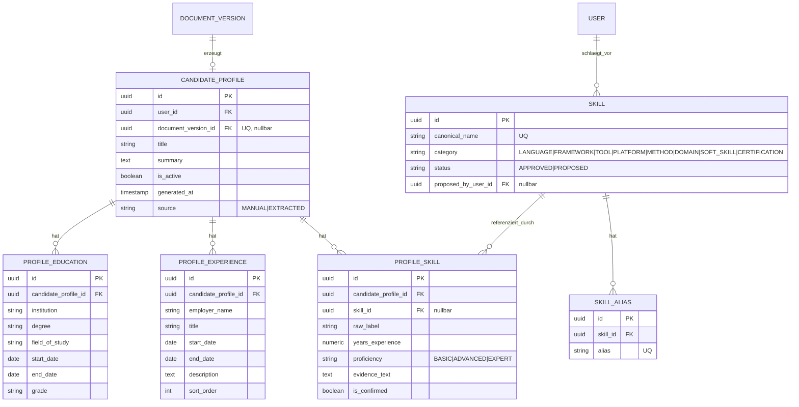

# Datenmodell — Fähigkeitenprofil und Skill-Taxonomie

Entspricht Epic E9. `Skill` ist bewusst **systemweit**, nicht
nutzergebunden — im Gegensatz zu praktisch jeder anderen Entität in
diesem Modell (siehe Ausnahme in Regel B.4-1).

**Zu beachten:**
- `CandidateProfile.document_version_id` ist eindeutig — höchstens ein
  bestätigtes Profil je Lebenslauf-Version (siehe E9-S04, Regel).
- `ProfileSkill.skill_id` ist nullbar: eine erkannte Fähigkeit kann
  zunächst unverknüpfter Freitext bleiben (`raw_label`), bevor sie einem
  kanonischen `Skill` zugeordnet wird (E9-S02).
- `Skill.proposed_by_user_id` verweist auf einen einzelnen Nutzer, obwohl
  die Entität selbst systemweit ist — das ist bewusst, da nur die
  *Urheberschaft* des Vorschlags nutzerbezogen ist, nicht der Skill selbst.
- `JobRequirement.skill_id` (siehe Diagramm 01) referenziert dieselbe
  `Skill`-Entität — daher taucht `Skill` in zwei Kontexten auf.
