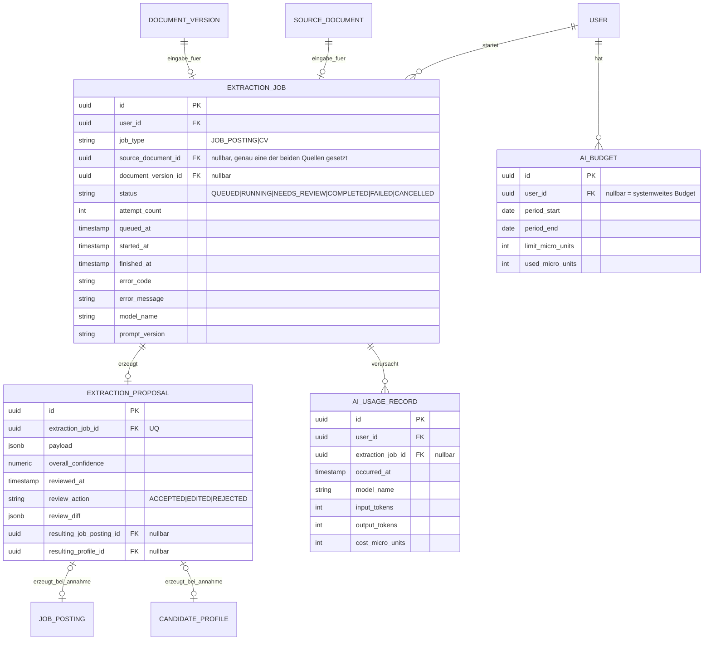

# Datenmodell — KI-gestützte Extraktion

Entspricht Epic E8. Leitprinzip: `ExtractionProposal` ist ein Vorschlag,
kein Bestand — erst nach Prüfung entstehen Datensätze in `JobPosting`
bzw. `CandidateProfile` (siehe Diagramme 01 und 04).

**Zu beachten:**
- `ExtractionJob` hat **zwei alternative** Quellreferenzen — genau eine
  ist gesetzt, je nach `job_type`. Im ER-Diagramm werden dafür zwei
  optionale Beziehungen gezeichnet; die Exklusivität selbst gehört als
  Check-Constraint ins Flyway-Skript, nicht ins Diagramm.
- `AiBudget.user_id` ist nullbar: `NULL` steht für das systemweite
  Gesamtbudget (E8-S04) und existiert als eigener Datensatz neben den
  nutzerbezogenen Budgets.
- Die Beziehungen von `ExtractionProposal` zu `JobPosting` und
  `CandidateProfile` sind **optional und einseitig gerichtet** (entstehen
  erst bei `review_action = ACCEPTED`/`EDITED`) — deshalb `|o--o|` statt
  einer verpflichtenden Kardinalität.
