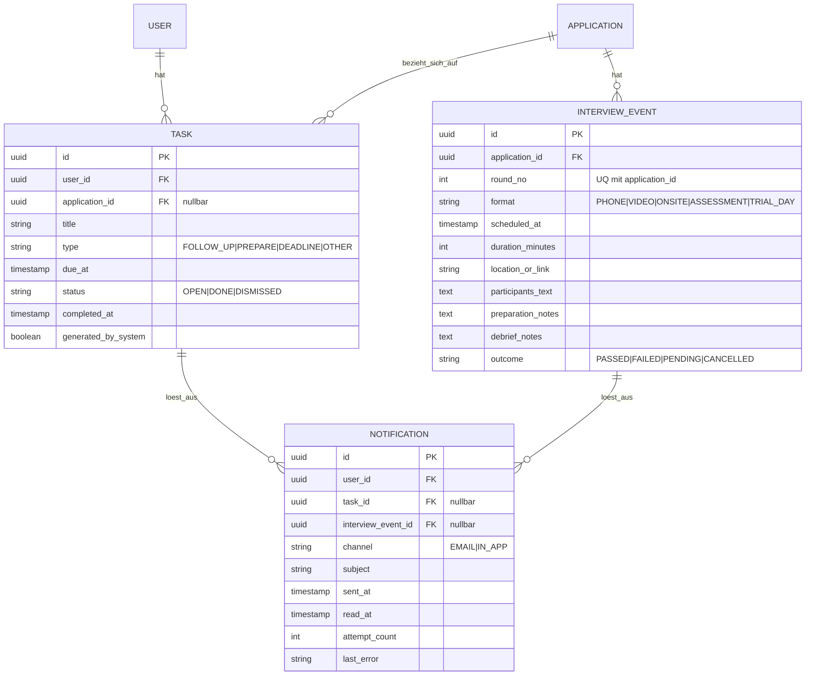

# Datenmodell — Termine, Aufgaben, Erinnerungen

Entspricht Epic E10.

**Zu beachten:**
- `Notification` hat zwei optionale Auslöser-Referenzen (`task_id`,
  `interview_event_id`) — praktisch ist meist genau eine gesetzt, aber
  anders als bei `ExtractionJob` ist das hier nicht strikt exklusiv
  erzwungen (eine allgemeine Systemnachricht könnte künftig ganz ohne
  Bezug stehen).
- Der eindeutige Schlüssel auf `Notification` über (`user_id`, `task_id`,
  `interview_event_id`, `channel`) verhindert doppelten Versand — im
  Diagramm nicht sichtbar, gehört als Constraint ins Skript.
- `Task.application_id` ist nullbar: nicht jede Aufgabe hängt an einer
  Bewerbung (z. B. rein persönliche Erinnerungen).
