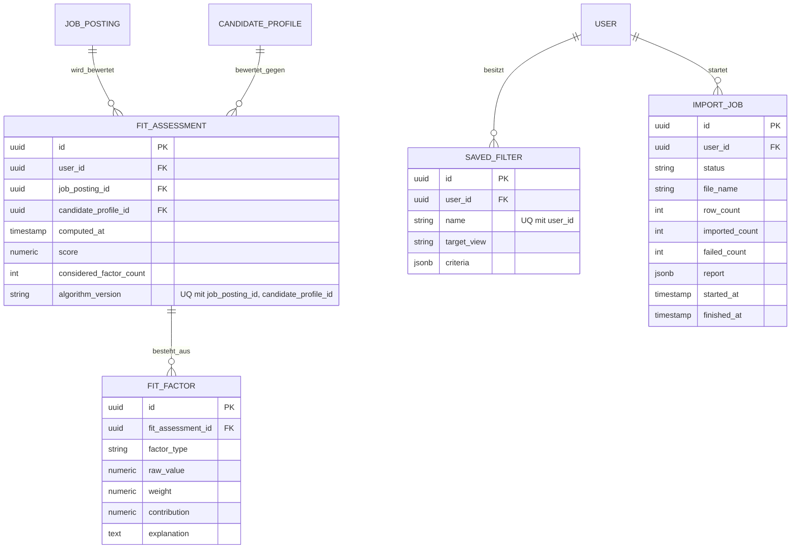

# Datenmodell — Passungsanalyse und Sonstiges

Entspricht dem optionalen Epic E13 sowie den Restfunktionen aus E12.

**Zu beachten:**
- `FitAssessment` ist je Kombination aus Anzeige, Profil **und**
  Algorithmusversion eindeutig — ändert sich das Bewertungsverfahren,
  entsteht ein neuer Datensatz statt einer Überschreibung. Das erhält die
  Nachvollziehbarkeit, falls sich die Gewichtung später ändert.
- `FitFactor.raw_value` kann fehlen (nullbar in der Praxis, hier aus
  Platzgründen nicht extra vermerkt) — ein nicht bewertbarer Faktor wird
  ausgeschlossen, nicht mit 0 bewertet (siehe E13-S01).
